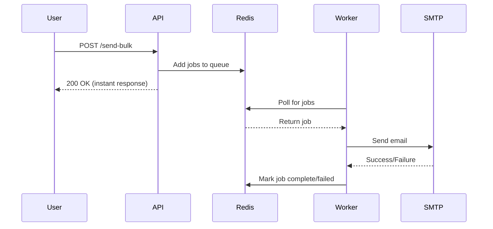

# 🚀 BullMQ POC: Bulk Email Sending

A beginner-friendly Proof of Concept (POC) demonstrating how to use **BullMQ** for sending bulk emails efficiently using a queue-based architecture.

## 📚 What You'll Learn

By the end of this POC, you'll understand:

- ✅ **What a Queue is** - A data structure that holds jobs to be processed
- ✅ **What a Worker is** - A background process that processes jobs from the queue
- ✅ **How jobs flow** - API → Redis → Worker
- ✅ **Why queues matter** - Better performance, scalability, and reliability than direct processing

## 🎯 POC Overview

### High-Level Flow

```
User clicks "Send Bulk Email"
        ↓
Backend API receives request
        ↓
Jobs added to BullMQ Queue (stored in Redis)
        ↓
API responds immediately ⚡
        ↓
Worker picks up jobs from queue
        ↓
Emails sent in background 📧
```

### Why This Approach?

**Without Queue (Traditional):**
- User waits for all emails to send
- API can timeout
- No retry mechanism
- Server can crash under load

**With BullMQ Queue:**
- User gets instant response ⚡
- Emails processed in background
- Automatic retries on failure
- Scalable (add more workers)
- Jobs persist in Redis (won't lose data)

## 🛠️ Tech Stack

| Component | Technology |
|-----------|-----------|
| **Backend** | Node.js + TypeScript |
| **Queue** | BullMQ |
| **Storage** | Redis |
| **Email** | Nodemailer (Gmail SMTP) |
| **Frontend** | React (simple UI) |
| **Database** | ❌ Not needed for POC |

## 📁 Project Structure

```
bullMQ-POC/
├── backend/
│   ├── src/
│   │   ├── config/          # Redis & Queue configuration
│   │   ├── controllers/     # API request handlers
│   │   ├── workers/         # Background job processors
│   │   ├── routes/          # API routes
│   │   ├── types/           # TypeScript types
│   │   └── index.ts         # Express server entry point
│   ├── package.json
│   ├── tsconfig.json
│   └── .env.example
├── frontend/                # React UI (to be created)
├── package.json             # Root package.json
└── README.md
```

## 🚀 Getting Started

### Prerequisites

Before you begin, ensure you have the following installed:

- **Node.js** (v18 or higher) - [Download](https://nodejs.org/)
- **Redis** (v6 or higher) - [Installation Guide](https://redis.io/docs/getting-started/installation/)
- **npm** or **yarn**

### Installation

#### 1. Clone the Repository

```bash
git clone <your-repo-url>
cd bullMQ-POC
```

#### 2. Install Root Dependencies

```bash
npm install
```

#### 3. Install Backend Dependencies

```bash
cd backend
npm install
```

#### 4. Start Redis

Make sure Redis is running on your machine:

```bash
# On Linux/Mac
redis-server

# On Windows (if using WSL)
sudo service redis-server start

# Verify Redis is running
redis-cli ping
# Should return: PONG
```

## 🎮 Running the Application

### Option 1: Run Backend Only (for now)

```bash
# Terminal 1: Start the API server
cd backend
npm run dev

# Terminal 2: Start the worker
cd backend
npm run worker
```

### Option 2: Run Everything (once frontend is ready)

```bash
# From root directory
npm run dev
```

This will start both backend and frontend concurrently.

## 🧪 Testing the POC

### Using cURL

```bash
# Send bulk emails
curl -X POST http://localhost:3000/api/emails/send-bulk \
  -H "Content-Type: application/json" \
  -d '{
    "recipients": [
      "test1@yopmail.com",
      "test2@yopmail.com",
      "test3@yopmail.com"
    ],
    "subject": "Test Bulk Email",
    "body": "This is a test email sent via BullMQ!"
  }'
```

### Using Postman

1. Create a POST request to `http://localhost:3000/api/emails/send-bulk`
2. Set header: `Content-Type: application/json`
3. Body (raw JSON):
```json
{
  "recipients": ["test1@yopmail.com", "test2@yopmail.com"],
  "subject": "Test Email",
  "body": "Hello from BullMQ!"
}
```

> 💡 **Tip:** Use [YOPmail](https://yopmail.com/) to check received emails. Just enter the email address (e.g., test1@yopmail.com) to view the inbox.

## 📊 How It Works (Deep Dive)

### 1. **Queue Creation** (`config/queue.ts`)
- Creates a connection to Redis
- Initializes a BullMQ Queue named "email-queue"

### 2. **API Endpoint** (`controllers/emailController.ts`)
- Receives bulk email request
- Creates individual jobs for each recipient
- Adds jobs to the queue
- Returns immediately (doesn't wait for emails to send)

### 3. **Worker Process** (`workers/emailWorker.ts`)
- Runs as a separate process
- Listens to the "email-queue"
- Picks up jobs one by one
- Sends emails using Nodemailer
- Handles retries on failure

### 4. **Job Flow**



## 🔧 Available Scripts

### Root Directory

| Command | Description |
|---------|-------------|
| `npm run dev` | Run both backend and frontend |
| `npm run dev:backend` | Run only backend |
| `npm run dev:frontend` | Run only frontend |

### Backend Directory

| Command | Description |
|---------|-------------|
| `npm run dev` | Start API server in watch mode |
| `npm run worker` | Start background worker |
| `npm run build` | Compile TypeScript to JavaScript |
| `npm start` | Run compiled JavaScript |

## 🐛 Troubleshooting

### Redis Connection Error

**Error:** `Error: connect ECONNREFUSED 127.0.0.1:6379`

**Solution:**
```bash
# Make sure Redis is running
redis-cli ping

# If not running, start it
redis-server
```

### Port Already in Use

**Error:** `Error: listen EADDRINUSE: address already in use :::3000`

**Solution:**
```bash
# Find process using port 3000
lsof -i :3000

# Kill the process
kill -9 <PID>

# Or change PORT in .env file
```

### Email Not Sending

**Solution:**
- Verify Gmail SMTP credentials are configured correctly
- Check YOPmail inbox at https://yopmail.com/
- Ensure "Less secure app access" is enabled for Gmail (or use App Password)
- Check worker logs for errors

## 📖 Key Concepts Explained

### What is a Queue?

A queue is like a line at a coffee shop. Jobs (customers) wait in line, and workers (baristas) process them one by one. This prevents overwhelming the system.

### What is Redis?

Redis is an in-memory data store that BullMQ uses to store queue data. It's fast and reliable.

### What is a Worker?

A worker is a separate process that runs in the background, constantly checking the queue for new jobs to process.

### Job Lifecycle

1. **Waiting** - Job added to queue
2. **Active** - Worker picked up the job
3. **Completed** - Job finished successfully
4. **Failed** - Job failed (will retry based on config)

## 🎓 Learning Resources

- [BullMQ Documentation](https://docs.bullmq.io/)
- [Redis Quick Start](https://redis.io/docs/getting-started/)
- [Nodemailer Guide](https://nodemailer.com/about/)
- [TypeScript Handbook](https://www.typescriptlang.org/docs/)

## 📝 License

MIT

## 🤝 Contributing

This is a learning POC. Feel free to fork and experiment!

---

**Happy Learning! 🎉**

If you have questions or run into issues, check the troubleshooting section or review the BullMQ documentation.
